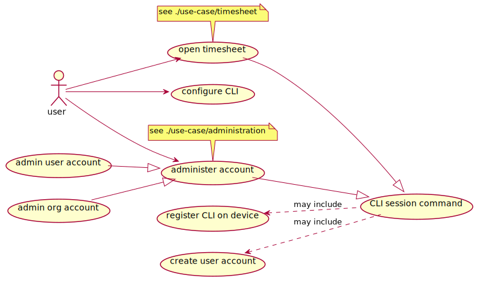
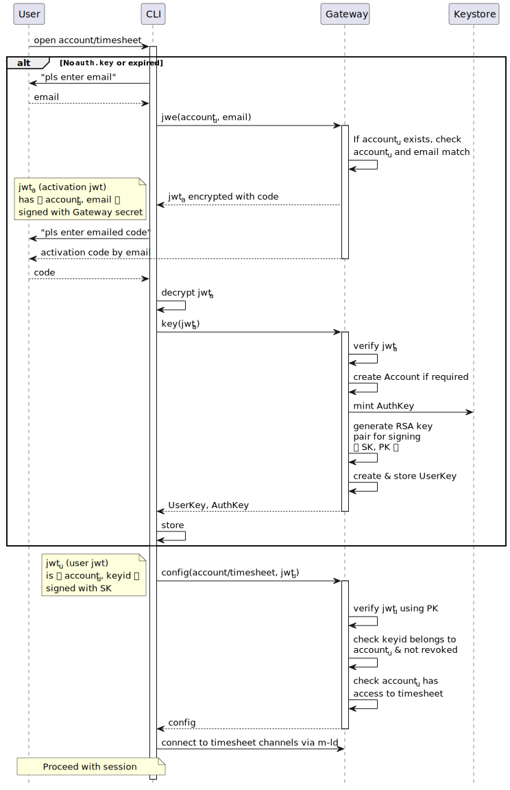

# security

## use-cases

## classes

### abbreviations

- _accountu_ is the user account
- _accountp_ is the provider account of a timesheet
- _accountc_ is the client account of a project (containing a timesheet)

### model

_Accounts_ exist to represent users and organisations which are the subjects of access control (in addition to being a container for service metadata such as contact and payment details).

_Projects_ exist to group timesheets (in addition to being a container for project metadata).

An account can be in the role of a _provider_ or a _client_. Accounts can be providers of Timesheets (via `Account.timesheet`), and clients of projects (via `Account.project`). An account can implicitly be the client of a timesheet if the timesheet references one of its projects (via `Timesheet.project`).

Instances of apps such as the CLI are associated with user accounts. As such, they have secret information that allow them to act as the user's local agent.

In the diagram, some classes are in common with the [data model](../data-model); only security-relevant properties are shown here.

### access control

Write access to timesheets is only allowed for the **provider** of the timesheet, whether a user account or the admin of an organisation account.

A user has read access to a timesheet if:
- the user, or an organisation which the user is an admin of, is the **provider** of the timesheet; OR
- the user, or an organisation which the user is an admin of, is a **client** of the timesheet (see definitions above).

Mapping of timesheets to projects can only be set by the timesheet provider (a user account or an admin of an organisation account). This supports the following story:

> As a time provider, I can add one of my timesheets to a project whose client is some organisation, so I can make my contributions visible to the client organisation's admins.

_Possible future enhancement: Project admins_

## process

### registration of the CLI

Headlines:

- Using email for account identity verification
- Devices (clients) are issued with keys
- The Socket.io server ensures all access to Timesheet domains must use a key belonging to a user with the correct access rights
- Account administration is remote (account details are not synced to the client)

